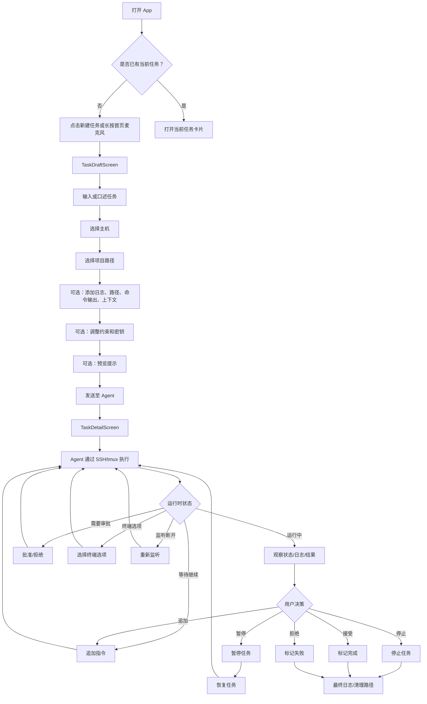

# Armin 当前 UX 分析

本文档基于当前 Flutter 代码阅读，目标是描述 Armin 现在实际向用户传达的产品心智。本文不讨论实现难度，不设计新功能，不修改代码。

## 1. 当前信息架构

```text
Root
├─ TaskHomeScreen
│  ├─ 当前任务
│  ├─ 近期任务
│  ├─ 首页语音采集面板
│  ├─ 新建任务入口
│  ├─ 任务历史入口
│  └─ 设置入口
├─ TaskDraftScreen
│  ├─ 原始/实时语音转写
│  ├─ 任务草稿
│  ├─ 主机选择器
│  ├─ 项目路径选择器
│  ├─ AGENTS.md 检测通知
│  ├─ 上下文辅助
│  ├─ 补充上下文
│  ├─ 执行约束
│  ├─ 密钥
│  ├─ 语音面板
│  ├─ 提示预览
│  └─ 发送至 Agent
├─ TaskHistoryScreen
│  └─ 历史任务卡片
├─ TaskDetailScreen
│  ├─ 摘要横幅
│  │  ├─ 状态
│  │  ├─ 标题编辑
│  │  ├─ 项目
│  │  └─ CLI
│  ├─ 运行时控制面板
│  │  ├─ 审批请求处理
│  │  ├─ 终端选项处理
│  │  ├─ 追加指令
│  │  ├─ 标记完成/失败
│  │  ├─ 暂停/恢复
│  │  ├─ 停止
│  │  ├─ 断开监听
│  │  └─ 重新监听
│  ├─ 时间线标签页
│  ├─ 结果标签页
│  │  ├─ 按轮次输出卡片
│  │  ├─ 语音播报
│  │  └─ 执行详情
│  ├─ 日志标签页
│  │  ├─ tmux 调试命令
│  │  └─ 审批请求
│  ├─ 指标标签页
│  └─ 溢出菜单
│     ├─ 重新执行
│     ├─ 强制停止
│     ├─ 清理远端会话
│     └─ 删除
└─ SettingsScreen
   ├─ HostListScreen
   │  └─ HostFormScreen
   ├─ ProjectPathListScreen
   │  └─ ProjectPathFormScreen
   └─ VoiceSettingsScreen
```

### 页面职责

`TaskHomeScreen` 同时承担着落地页和任务队列的角色，展示当前任务、近期任务、中央麦克风、新建任务入口、历史记录和设置。其视觉第一印象在任务列表和语音助手之间摇摆。

`TaskDraftScreen` 是任务创建与执行配置页面，要求用户定义任务、选择主机和项目路径、添加上下文、设置约束、添加密钥、预览最终提示，然后发送至 Agent。这不仅仅是任务创建——它在用户看到任何价值之前就暴露了执行配置。

`TaskHistoryScreen` 是一个简单的归档列表，大量复用了首页的任务卡片浏览行为，但去掉了"当前任务"的强调。

`TaskDetailScreen` 是真正的协作界面，包含状态、运行时控制、审批、终端选择、追加指令、结果朗读、日志、指标及清理操作。它当前既是面向用户的任务页面，也是远程 tmux 会话的操作控制台。

`SettingsScreen` 是执行环境中枢，首要概念是主机连接、项目目录和语音播报，强化了 Armin 控制远程执行环境的定位。

## 2. 当前用户旅程

### 完整任务流程



### 观察到的旅程特征

- 预期的任务循环确实存在：创建、执行、检查、追加、暂停、恢复、停止、完成。
- 首次任务创建旅程配置负载重。主机、项目路径、tmux、Agent 命令、提示预览、约束和密钥均在必经路径上。
- 持续协作旅程以任务详情为中心，但主要输入并非始终可见。追加指令隐藏在控制按钮和底部弹窗之后。
- 结果浏览旅程分散在时间线、结果、日志和指标四个标签页中。用户必须自行判断哪个标签页能回答"发生了什么？"

## 3. 当前心智模型

### 分类

当前 Armin 属于 **E. 混合型**，其中最强的拉力来自 **D. 远程控制优先**，次级拉力来自 **B. 任务优先**。

它不是以对话优先，因为没有连续的聊天线程作为顶层对象。不是纯粹以 Agent 优先，因为任务拥有自己的卡片、状态、历史、标题和轮次。也不是干净的任务优先，因为 UI 反复暴露主机、CLI、tmux、提示预览、原始日志、重连、清理会话和 Agent 命令等概念。这些概念使任务感觉像是包裹在远程 Agent 会话外的一层壳。

### 为什么感觉是混合型

- 首页写着 `AI coding agent Shell`，将应用定位为 shell/控制器，而非任务工作区。
- 首页最大的操作是麦克风，暗示语音助手在任务协调之前。
- 任务卡片和任务详情使 Task 作为核心对象可见。
- 任务草稿要求在发送前完成执行配置，将用户拉入远程运行时管理。
- 任务详情在同一区域暴露产品操作和运维操作：追加、完成、暂停、停止、断开监听、重新监听、清理远端会话、tmux 调试命令。
- 结果、日志、指标、轮次、审批请求和终端选项营造了一种高级用户控制台的感觉。

### 首次用户印象

首次用户最可能按以下顺序认为 Armin 是：

1. 一个用于编程 Agent 的移动控制器。
2. 一个语音驱动的 Agent 启动器。
3. 一个远程 SSH/tmux 任务运行器。
4. 一个 Agent 任务管理器。
5. 一个轻量级 Agent 客户端。

当前 UI 首先传达的不是"异步任务协调层"，而是"我可以对着一个移动 shell 说出请求，让它把工作发送给远程编程 Agent。"

## 4. 认知负荷分析

### 概念负荷

用户在使用模型感到稳定之前，必须理解诸多概念：

- 任务
- 当前任务
- 近期任务
- 历史任务
- 草稿
- 提示预览
- Agent
- CLI
- 主机
- SSH 密码
- 项目路径
- tmux 会话
- PATH / shell 包装器
- AGENTS.md
- 约束
- 密钥
- 语音输入
- 语音播报
- 原始 STT
- 清洗后草稿
- 状态
- 轮次
- 时间线
- 结果
- 日志
- 指标
- 暂停
- 恢复
- 停止
- 完成
- 失败
- 审批
- 终端选项
- 断开监听
- 重新监听
- 清理远端会话
- 运行时丢失

对一个移动端产品而言，这个概念数量偏高。部分概念是准确的实现细节，但它们与新的以任务为中心的定位形成竞争。

### 导航负荷

追加指令：

```text
首页
-> 点击任务卡片
-> 任务详情
-> 找到运行时控制
-> 点击追加指令
-> 输入或长按语音追加
-> 发送
```

最少需要打开应用后 5 到 6 步操作，取决于当前任务是否已可见以及使用打字还是语音。

查看结果：

```text
首页
-> 点击任务卡片
-> 任务详情
-> 可能需切换到结果标签页
-> 浏览按轮次输出卡片
-> 可选展开完整输出或播放语音
```

最少 2 到 5 步。应用在某些场景下恢复时可能自动展示结果标签页，但正常的可见信息架构仍然要求用户在时间线、结果、日志和指标之间选择。

暂停任务：

```text
首页
-> 点击任务卡片
-> 任务详情
-> 运行时控制
-> 暂停
```

最少 3 步。

恢复任务：

```text
首页
-> 点击任务卡片
-> 任务详情
-> 运行时控制
-> 恢复
```

最少 3 步。

完成任务：

```text
首页
-> 点击任务卡片
-> 任务详情
-> 运行时控制
-> 标记完成
```

最少 3 步。

### 决策负荷

用户频繁需要做出以下判断：

- 应该用语音还是文本创建？
- 这是新任务、近期任务还是历史任务？
- 选哪台主机运行？
- 选哪个项目路径运行？
- 需要预览提示吗？
- 应该添加上下文、约束、密钥还是命令输出吗？
- 任务是运行中、等待中、已暂停、已断开还是已丢失？
- 应该看时间线、结果、日志还是指标？
- "等待继续"是已完成状态还是在请求更多输入？
- 应该追加、暂停、停止、完成、失败、重连还是断开？
- 审批请求和终端选项有区别吗？
- 语音播报读的是正确的输出吗？
- 我应该清理远端会话吗？

### 十大认知成本

1. **任务与会话的歧义。** UI 说的是任务，但许多控件的行为像会话控制。
2. **语音主导但角色不清。** 中央麦克风暗示语音是产品中心，而期望的模型认为任务是中心。
3. **任务创建中暴露执行配置。** 主机、项目路径、Agent 命令、AGENTS.md、tmux、约束和密钥在用户拥有简单任务循环之前就出现了。
4. **状态词汇偏技术化。** `turnIdle`、监听断开、运行时丢失、清理会话和终端选项不是日常任务状态。
5. **多个地方回答"发生了什么？"** 时间线、结果、日志和指标碎片化了对任务的理解。
6. **追加指令隐藏在运行时控制之后。** 核心协作操作不是一个常驻的任务编辑器。
7. **接受工作与运行时控制在视觉上等同。** 标记完成、标记失败、停止、暂停和断开排列在一起，使接受和控制感觉相似。
8. **提示预览与任务意图竞争。** 它暴露了实现细节，可能让用户觉得自己需要负责提示工程。
9. **设置将产品定义为基础设施。** 主机和项目目录是必要的，但它们的突出程度使 Armin 感觉像一个 SSH 配置应用。
10. **语音输入和语音播报是分离的概念。** 口述任务、口述追加、语义语音命令和朗读输出都属于"语音"，但行为各不相同。

## 5. 交互分析

### 核心交互入口

当前主要入口有：

- **语音：** 首页麦克风、草稿语音面板、追加语音按钮、审批语音处理、终端选项语音处理、结果播报。
- **任务卡片：** 当前任务和近期任务打开真正的工作区。
- **运行时控制按钮：** 追加、完成、失败、暂停/恢复、停止、重连、断开。
- **标签页：** 时间线、结果、日志、指标。
- **设置：** 主机、项目路径、语音设置。

### 当前什么才是真正的核心

最重要的交互是**任务详情的运行时控制**，不是聊天，也不是首页语音。用户在此处可以继续、暂停、恢复、停止、审批、重连、检查和接受工作。

然而，视觉上最突出的交互是首页的**语音采集**。这种不匹配造成了一个产品信号问题：应用看起来是语音优先的，但其持久价值在于任务状态管理。

### 用户的时间花在哪里

用户最有意义的时间大多花在：

1. `TaskDetailScreen`，阅读状态、输出、日志并决定下一步操作。
2. `TaskDraftScreen`，准备任务和执行目标。
3. 首页，短暂浏览当前和近期任务卡片。
4. 设置，大多在初始配置或排障时使用。

当前 UX 使持续监督比轻量异步协调更重，因为任务详情同时包含了协作层和运行时检查层。

## 6. 可见性分析

### 产品是否展示了"工作正在进行"？

部分做到了。

当前积极信号：

- 特色任务卡片显示状态、已用时间、进度标签和运行中的不确定进度。
- 任务详情有状态徽章和运行中的动画运行时徽章。
- 时间线展示任务确认、发送至 Agent、语音添加和最终结果。
- 结果标签页有按轮次输出卡片。
- 原始日志和 tmux 命令暴露了真实执行。

当前缺口：

- 进度不是语义化的。"运行中"和一个进度条并不解释 Agent 现在在做什么。
- 首页卡片摘要可能是简短的输出片段，而不是明确的下一步状态。
- 最精确的进度证明可能隐藏在结果或日志标签页中。
- `turnIdle`/"等待继续"可能看起来像是进度暂停、任务完成或需要用户操作。
- 指标作为标签页存在但当前显示渲染已禁用，削弱了信心。
- UI 暴露执行机制多于工作叙事。

### 首页第一眼

打开首页时，第一眼看到的是：

1. **品牌和品类：** Armin，`AI coding agent Shell`。
2. **任务：** 当前任务/近期任务。
3. **语音：** 大型中央麦克风。
4. **状态：** 任务卡片上的徽章和进度。
5. **Agent/执行：** 任务卡片上的 CLI 和主机标签。

第一印象不是纯粹的任务工作区，而是一个附加在语音控制 Agent shell 上的任务队列。

## 7. 竞品映射

此比较关注心智模型而非功能覆盖度。

| 产品 | 一等公民 |
| --- | --- |
| ChatGPT Mobile | 对话 |
| Codex Mobile | Agent 会话/编程任务会话 |
| Claude Mobile | 对话 |
| Litter | Agent 会话 |
| Slack | 对话 |
| 飞书 | 组织对话/工作区对象 |
| Jira | Issue |
| Linear | Issue/项目工作项 |
| Todoist | 任务 |
| Armin（当前） | 混合型：包裹在远程 Agent 会话周围的任务 |

Armin 当前位于 Todoist/Jira 类工作项和 Codex/Litter 类 Agent 会话之间。UI 有足够的任务结构避免了纯粹聊天，但又有足够的运行时/会话暴露阻止了干净的任务优先模型。

## 8. UX 债务

十大 UX 债务，按严重程度排序：

1. **首屏产品品类冲突。** `AI coding agent Shell` 加上巨大麦克风与期望的以任务为中心的协调层冲突。
2. **任务详情承担双重角色。** 面向用户的协调和远程运行时调试被合并到一个页面中。
3. **核心追加操作在结构上不是首要的。** "追加指令"是运行时控制中的一个按钮，而不是任务的自然延续。
4. **过多技术状态泄露到用户认知中。** 监听断开、运行时丢失、轮次空闲、清理会话、终端选项、tmux 和指标作为产品级概念暴露。
5. **创建流程因执行配置而过载。** 用户在 Armin 建立简单的任务优先循环之前，就必须面对主机/项目/提示/约束/密钥。
6. **结果理解是碎片化的。** 时间线、结果、日志、按轮次展开、语音播报和执行详情竞争回答同一个问题。
7. **语音没有单一的心智角色。** 它既是创建输入、追加输入、语义命令解析器、审批处理器、终端选项选择器，又是输出播报。
8. **接受工作在视觉上与运行时控制等同。** 标记完成、标记失败、暂停、停止、断开和重连以同级控件出现。
9. **首页不能清晰代表多任务工作区。** 它突出一个当前任务和近期任务，但没有强烈传达并行任务协调或注意力分流。
10. **基础设施设置在品牌认知中过于突出。** 主机连接和项目路径是必要的，但当前信息架构使它们感觉是产品的基础，而不是任务委派的隐藏前提。

## 9. 设计方向分析

如果 Armin 希望从"远程 Agent 控制器"进化为"以任务为中心的 Agent 协调层"，最大的障碍不是能力缺失，而是当前 UI 仍然要求用户像 Agent 会话的操作员一样思考。

### 当前最大的 UI/UX 障碍

- 首屏将 Armin 定位为 shell 和语音工具，而非任务协调层。
- 任务创建过早暴露远程执行配置。
- 任务详情将运维控件和调试构件与用户决策以同等层级暴露。
- UI 将任务状态、会话状态和观察者状态视为同等重要。
- 输出模型仍然接近日志和轮次，而非包含进展、提问、决策和接受的任务叙事。

### 必须改变的心智模型

当前心智模型：

```text
选择远程环境
-> 向 Agent 会话发送提示
-> 观察会话
-> 控制会话
-> 读取输出
```

需要的心智模型：

```text
创建任务
-> 让它持续运行
-> 当任务有进展、有问题或有结果时返回
-> 添加上下文或做出决策
-> 接受或继续任务
```

### 应隐藏或降级的概念

在任务中心模型中，以下概念不应是一级产品概念：

- tmux 会话
- tmux 清理
- 监听断开
- 重新监听
- 运行时丢失
- Agent 命令
- shell 包装器
- PATH 前置
- 原始日志
- 指标节点
- 提示预览
- 终端选项详情
- 主机配置详情

它们可以保留用于排障，但目前占据了过多的用户注意力。

### 应突出的概念

以下概念应在用户心智模型中变得更加突出：

- 任务
- 以人类术语表达的任务状态
- 自上次查看以来发生了什么变化
- Agent 需要用户做什么
- 最新有用结果
- 下一步决策
- 继续/添加上下文
- 暂停/恢复工作
- 接受结果
- 多个活跃任务和注意力队列
- 作为任务历史而非原始运行时历史的审计追溯

### 客观总结

当前 Armin 已经具备了以任务为中心的异步 Agent 协调所需的要素，但 UI 仍然通过远程 Agent 控制的视角来呈现它们。用户可以协调工作，但必须理解过多的会话、日志、主机配置和语音模式才能有信心地完成。

最明确的 UX 方向是让 Task 成为可见对象，让用户决策成为首要操作，让远程执行细节退居次要。语音应该成为任务上下文中的一种输入方式，而不是产品的第一印象。
